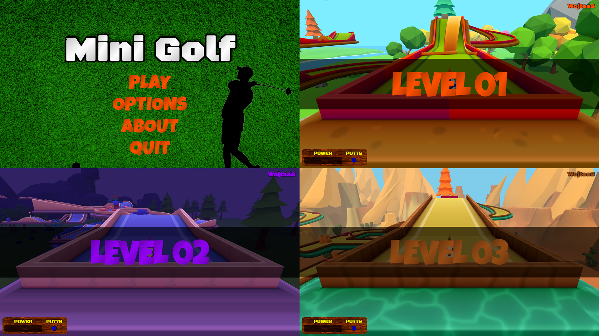

# 🏌️‍♂️ Mini Golf Game in Unity  

  

Mini Golf is an exciting Windows game where your goal is to guide the ball into the hole using as few strokes as possible. Compete against up to five players across three diverse and challenging levels designed to test your skills!  

---

## 🎮 Controls  

- **A and D:** Rotate the aiming reticle left or right.  
- **Space:** Control the shot power and execute the shot.  
- **Z:** Free camera mode.  
- **Mouse:** Rotate the camera in free camera mode.  
- **Mouse Wheel:** Zoom the camera in free camera mode.  
- **ESC:** Pause and return to the main menu.  

---

## 🌟 Features  

- **Multiplayer Fun:** Play with up to five players on the same device.  
- **Three Diverse Levels:** Each course offers a unique design and increasing difficulty.  
- **Immersive Gameplay:** Smooth camera controls, precise aiming, and realistic physics.  

---

## 🔗 Play Online  

Experience the game online:  
[**Mini Golf Online Version**](https://play.unity.com/pl/games/d58b3f13-abcc-47ca-b04d-e9b89f02594a/mini-golf)  

---

## 🛠️ Development  

- Created with **Unity** and many hours of dedication.  
- Features **C# scripts** for physics, interactions, and player controls.  
- Includes handcrafted levels and mechanics optimized for fun gameplay.  

---

Get ready for the challenge and enjoy an exciting gameplay experience!
